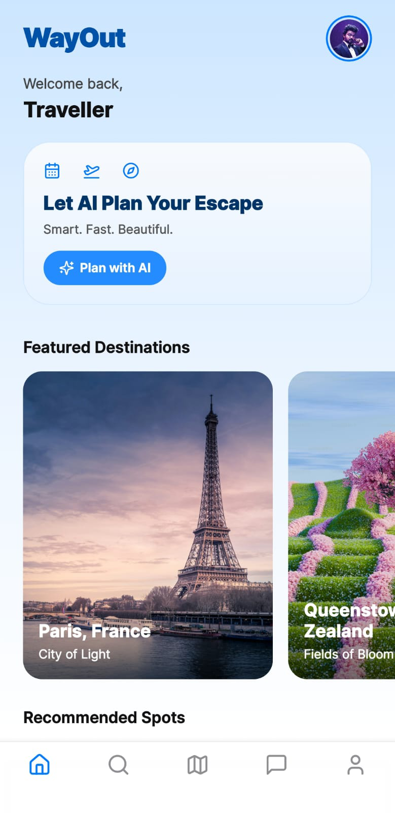
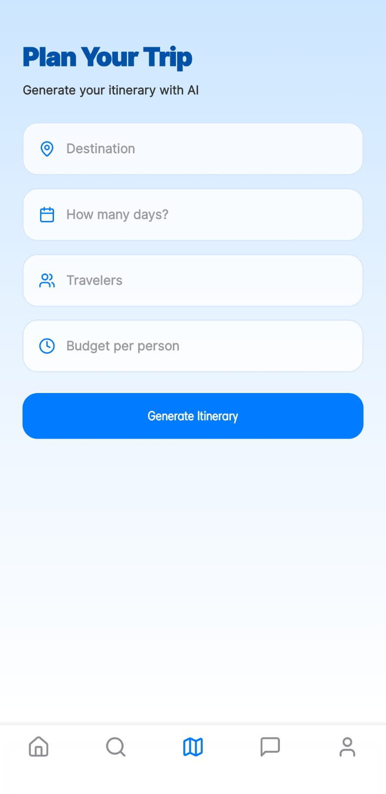
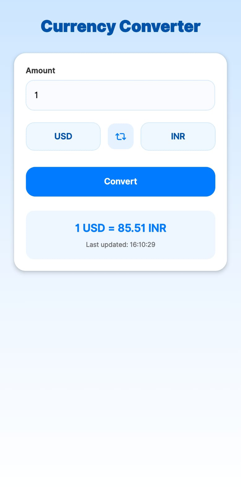
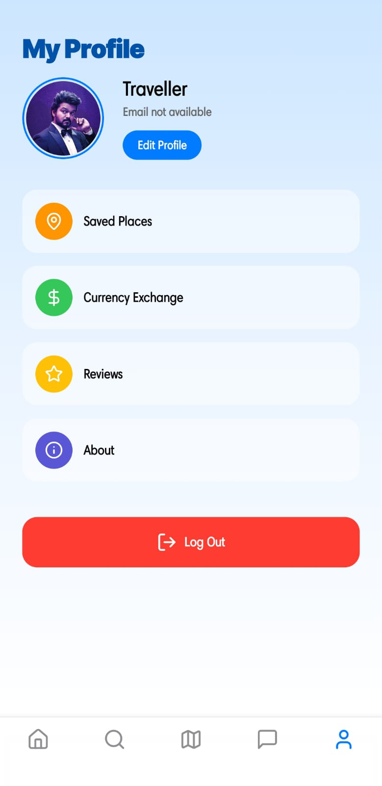

# ✈️ Wayout App

Wayout is an **AI-powered trip planner** built with **React Native**. It helps travelers create personalized itineraries based on the number of people, trip duration, and budget. The app leverages **Cohere AI** for chat assistance, **Mistral AI** for itinerary generation, **Supabase** for authentication and storage, and **Unsplash** (or Pixcel AI) for destination photos.

---

## 🌟 Features

- 🧠 **AI Trip Planning**
  - Automatically generate itineraries with Mistral AI.
  - Customize trips by destination, days, and budget.

- 💬 **Smart Chatbot**
  - Cohere AI chat assistant to answer travel-related questions.

- 🗂️ **Predefined Packages**
  - Browse and customize curated travel packages.

- 🏞 **Dynamic Destination Images**
  - Fetch high-quality photos using Unsplash API.

- 💱 **Currency Conversion**
  - Convert currencies to plan expenses.

- 💾 **Trip Saving**
  - Save trips securely to Supabase.

- 🔐 **Authentication**
  - Sign up and log in to keep data private.

---

## 🛠️ Tech Stack

- **Frontend:** React Native (Expo)
- **Backend:** Supabase (Postgres + Auth)
- **AI Engines:** Cohere AI, Mistral AI
- **Photos:** Unsplash API *(or Pixcel AI)*
- **APIs:** Currency exchange and travel services

---

Here's the updated **README** with:

* ✅ **Supabase DB section re-added**
* ✅ **Image section for app screenshots included**
* ✅ Clean structure for easy reading and usage

---

## ⚙️ Installation

### 1️⃣ Clone the repository

```bash
git clone https://github.com/your-username/wayout-app.git
cd wayout-app
````

---

### 2️⃣ Install dependencies

```bash
npm install
```

---

### 3️⃣ Configure environment variables

Create a `.env` file in your project root:

```
# Supabase
EXPO_PUBLIC_SUPABASE_URL=https://your-project-id.supabase.co
EXPO_PUBLIC_SUPABASE_ANON_KEY=your-anon-key

# Cohere AI
COHERE_API_KEY=your-cohere-api-key

# Mistral AI
MISTRAL_API_KEY=your-mistral-api-key

# Unsplash
UNSPLASH_ACCESS_KEY=your-unsplash-access-key
```

✅ **Important:**
Never commit `.env` to version control.

---

### 4️⃣ Run the app

```bash
npm start
```

---

## 🗃️ Supabase Database Setup

Create the following tables in Supabase:

### 📄 `trips` Table

```sql
create table trips (
  id uuid primary key default uuid_generate_v4(),
  user_id uuid references auth.users(id),
  destination text,
  duration integer,
  travelers integer,
  budget integer,
  plan text,
  created_at timestamp with time zone default timezone('utc'::text, now())
);
```

### 👤 `profiles` Table

```sql
create table profiles (
  id uuid primary key references auth.users(id),
  name text,
  phone text,
  avatar_url text
);
```

### 🔐 Enable RLS and Add Policies

```sql
-- Enable RLS
alter table trips enable row level security;
alter table profiles enable row level security;

-- Insert trips only by owner
create policy "Allow insert by authenticated"
on trips for insert to authenticated
with check (auth.uid() = user_id);

-- Select trips only by owner
create policy "Allow select by owner"
on trips for select to authenticated
using (auth.uid() = user_id);

-- Insert profiles only by owner
create policy "Insert own profile"
on profiles for insert to authenticated
with check (auth.uid() = id);

-- Select own profile
create policy "Select own profile"
on profiles for select to authenticated
using (auth.uid() = id);
```

---

## 🧠 AI Services

* **Cohere AI** – Chat Assistant (`command-r-plus` model)
* **Mistral AI** – Trip Itinerary Generator (`mistral-tiny` model)

✅ **Note:** Replace placeholder API keys in your `.env`.

---

## 🏞 Photo Service

* **Unsplash API**

  * Dynamically fetch images for travel destinations.
  * Optionally replace with Pixcel AI or custom sources.

---

## 🖼️ App Screenshots

<table>
  <tr>
    <td align="center"><strong>🏠 Home Page</strong><br></td>
    <td align="center"><strong>🧠 Chatbot</strong><br></td>
  </tr>
  <tr>
    <td align="center"><strong>🗺️ Trip Planner</strong><br></td>
    <td align="center"><strong>🎒 Packages</strong><br></td>
  </tr>
  <tr>
    <td align="center"><strong>💱 Currency Exchange</strong><br></td>
    <td align="center"><strong>👤 Profile Page</strong><br></td>
  </tr>
</table>

---

## 🤝 Contributing

Contributions are welcome!

1. Fork this repository.
2. Create a feature branch.
3. Commit your changes.
4. Open a pull request.

---

## 📄 License

MIT License

---

## 📢 Notes

✅ **Keep all API keys secure.**
✅ **Do not commit `.env` files.**
✅ **Use Supabase RLS to protect user data.**

---
